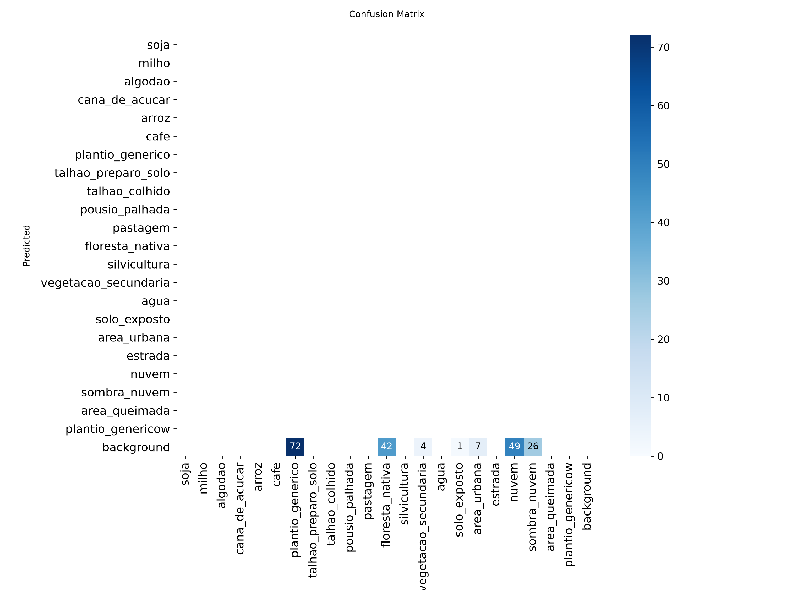
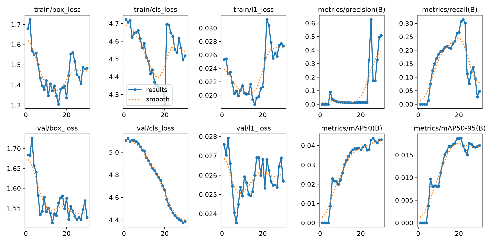
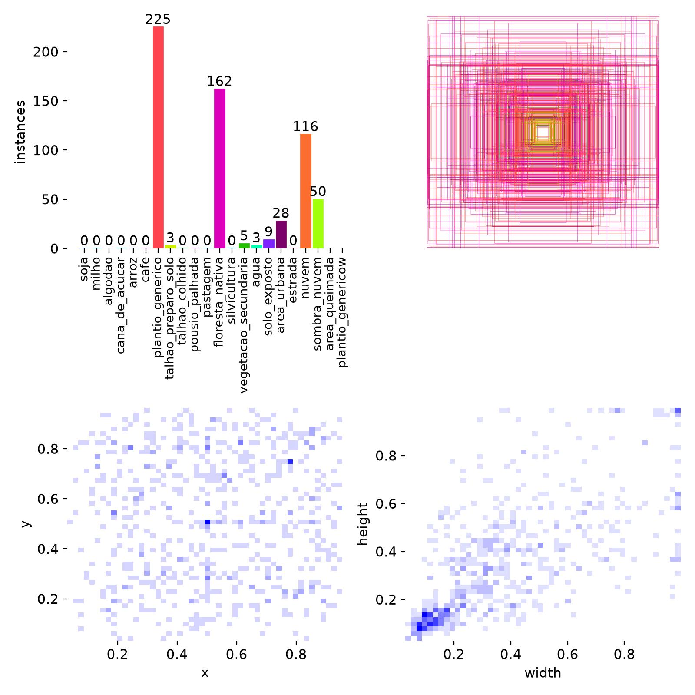

# Modelo de IA para análise agrícola

## Estado atual

A aplicação possui o adaptador e o pipeline de detecção Ultralytics YOLO, e o
peso aprovado agora acompanha a árvore de desenvolvimento:

```text
src/sentinel2_mt/analise/models/best.pt
```

Os testes continuam exercitando validação, inferência, estatísticas, overlay,
PDF e histórico com pesos, imagens e detectores sintéticos. Eles não validam a
acurácia do modelo nem substituem uma campanha formal de validação em campo.
Treinamento não faz parte do produto documentado.

## Requisitos de execução

- `ultralytics` carrega o arquivo `.pt` e executa a predição;
- `torch` seleciona e executa o backend CPU ou CUDA;
- `matplotlib` gera `relatorio.pdf` quando `analise.gerar_relatorio` é `true`;
- Pillow processa a entrada RGB e grava os overlays.

Essas dependências são instaladas pelos requisitos do projeto; o bundle Linux
as coleta durante o build. O peso é empacotado junto com o software, então a
execução padrão já encontra o arquivo.

Com `dispositivo="auto"`, usado pelo serviço, o detector escolhe `cuda:0` quando
`torch.cuda.is_available()` é verdadeiro e usa `cpu` nos demais ambientes. A
seleção efetiva aparece no log, em `resultado.json` e no histórico. Não há uma
chave YAML pública para forçar o dispositivo nesta versão.

## Instalação e substituição do peso

Para desenvolvimento pelo código-fonte, mantenha o peso aprovado exatamente em:

```text
src/sentinel2_mt/analise/models/best.pt
```

O valor YAML continua relativo:

```yaml
analise:
  modelo: analise/models/best.pt
```

O resolvedor aceita somente arquivo local regular com extensão `.pt`, contido
em uma raiz confiável. URLs, links simbólicos, diretórios e escapes para fora
dessas raízes são rejeitados. Para usar outro nome, mantenha o `.pt` dentro da
raiz do projeto/configuração ou do pacote e atualize `analise.modelo`. Em um
pacote, o peso precisa ter sido incluído no bundle durante o build; o caminho
`src/...` acima é exclusivo da árvore de desenvolvimento.

Substituir o arquivo pode mudar classes, resultados e compatibilidade. Atualize
o SHA-256 e o metadata juntos, gere um novo pacote quando aplicável e preserve a
proveniência do peso. A aplicação não baixa modelos automaticamente.

## SHA-256 e metadata

O campo `sha256` do `model_metadata.json` é obrigatório para o backend real e
funciona como manifesto aprovado do peso. `analise.modelo_sha256` é uma cópia
opcional; quando preenchida, deve conter os mesmos 64 dígitos hexadecimais. O
detector cria um snapshot privado dos mesmos bytes que valida e interrompe a
execução se qualquer valor divergir.

Calcule o hash sem copiar o conteúdo do modelo:

```bash
sha256sum src/sentinel2_mt/analise/models/best.pt
```

Copie somente a primeira coluna para o YAML:

```yaml
analise:
  modelo_sha256: 0123456789abcdef0123456789abcdef0123456789abcdef0123456789abcdef
```

O arquivo adjacente
`src/sentinel2_mt/analise/models/model_metadata.json` descreve o modelo. O
metadata atual declara nome, versão, framework, tarefa, entrada RGB B04/B03/B02
`uint8` e tamanho 640. O serviço usa `version` como versão pública do modelo e
registra essa versão, o SHA-256 calculado, as classes expostas pelo peso e o
dispositivo. Metadata ausente resulta em versão `não informada`; JSON inválido
interrompe a análise.

Ao instalar um peso aprovado, preencha também o manifesto:

```json
{
  "name": "Sentinel MT Agriculture Detector",
  "version": "2.1.0-beta.1",
  "sha256": "HASH_SHA256_DE_64_DIGITOS",
  "framework": "Ultralytics YOLO",
  "task": "detection",
  "input_size": 640
}
```

## Configuração pública

```yaml
analise:
  modelo: analise/models/best.pt
  modelo_sha256: ''
  confianca_minima: 0.25
  iou_maximo: 0.45
  tamanho_inferencia_px: 640
  pasta: data/analises
  historico: data/historico-analises.sqlite3
  gerar_relatorio: true
  max_imagens: 1000
```

- `confianca_minima`: descarta resultados abaixo do limiar, entre 0 e 1;
- `iou_maximo`: parâmetro de supressão de caixas sobrepostas, entre 0 e 1;
- `tamanho_inferencia_px`: tamanho positivo passado ao Ultralytics;
- `pasta`: raiz de overlays, JSON e PDF por análise;
- `historico`: banco SQLite local de resumos, metadata e caminhos;
- `gerar_relatorio`: habilita o PDF e, portanto, requer Matplotlib;
- `max_imagens`: limita os patches RGB aprovados; o default é 1000 e zero remove
  esse limite, devendo ser usado com cautela em catálogos grandes;

Configurações sem a seção `analise` continuam carregando com esses defaults.
Nos pacotes Linux, `pasta` e `historico` usam
`~/.local/share/sentinel2-mt`; esse layout instalado é diferente dos caminhos
de desenvolvimento.

Por segurança, `analise.pasta` e `analise.historico` devem permanecer dentro da
raiz de dados da aplicação; escapes por `..`, caminhos externos e links
simbólicos são rejeitados antes da inferência.

## Entrada, saída e limitações

O detector recebe somente o PNG RGB identificado por UUID dos patches aprovados no catálogo. O
GeoTIFF `multiband.tif` permanece como dado científico, sem alteração de dtype,
nodata, máscara ou georreferenciamento. O detector retorna caixas `(x1, y1,
x2, y2)` em pixels, classe, identificador da classe e confiança. A aplicação
também registra SHA-256 da entrada e do modelo, dimensões, nuvens quando
disponíveis e versões.

Se `dataset.rgb.gerar_png` estiver desabilitado, ou se nenhum patch aprovado
tiver B04/B03/B02 e `rgb_png` local, a análise termina informando que não
encontrou patch RGB aprovado.

As estatísticas são contagens e distribuições de confiança. A bbox da área
serve para consultar e identificar a região, mas não transforma caixas em
geometrias agrícolas. Sem escala, resolução espacial e geometria
georreferenciada validadas, quantidade ou área em pixels das caixas não pode ser
convertida nem apresentada como hectares.

O resultado depende do peso fornecido, das classes nele codificadas, do stretch
RGB, da resolução espacial efetiva, da composição temporal, de nuvens, sombras,
fenologia e mistura de pixels. Reamostrar ou aumentar dimensões não cria
detalhe espacial novo.

## Evidências do treinamento

Os seguintes artefatos do treino acompanham esta documentação para registrar o
comportamento observado do peso `best.pt`:






